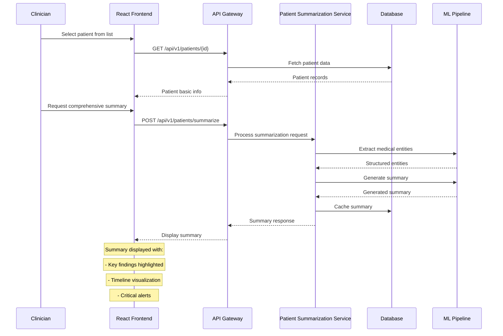
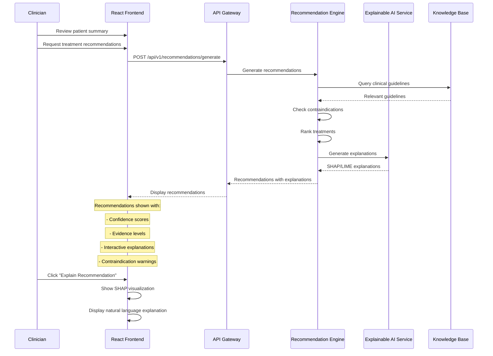
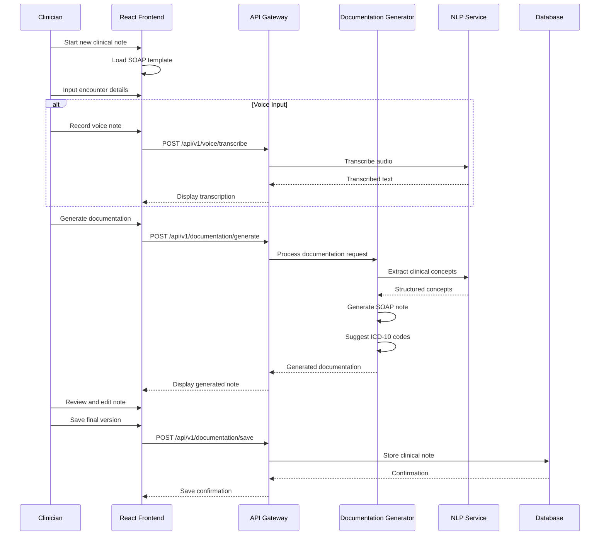
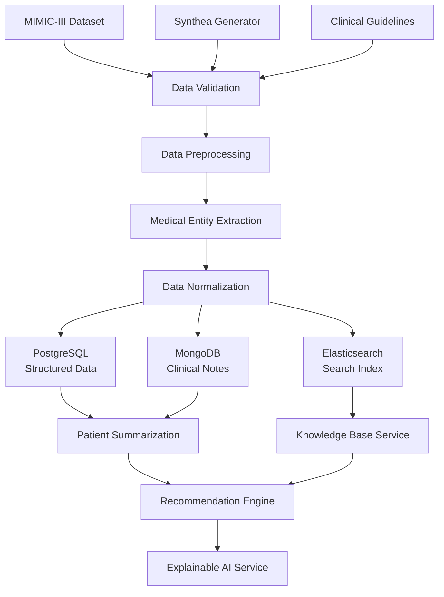
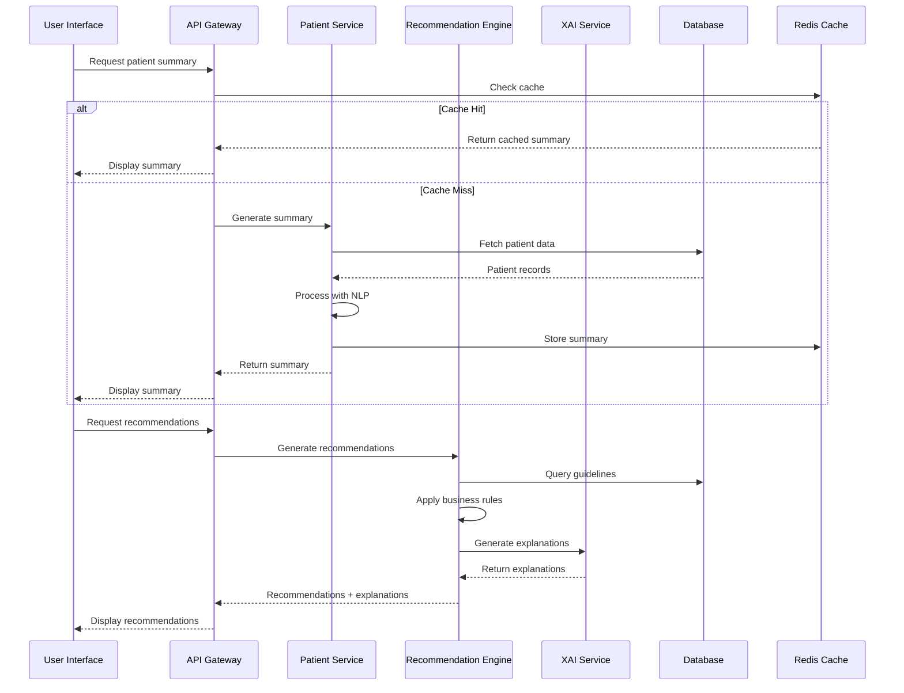

# MediCare Navigator - Technical Design Document

## Executive Summary

This document provides the complete technical architecture for **MediCare Navigator**, an AI-powered Clinical Decision Support System (CDSS) that reduces clinician documentation burden through interpretable artificial intelligence. The system processes synthetic healthcare data to provide evidence-based treatment recommendations with full explainability.

---

## Table of Contents

1. [Problem Statement](#1-problem-statement)
2. [System Architecture](#2-system-architecture)
3. [Component Breakdown](#3-component-breakdown)
4. [Technology Stack](#4-technology-stack)
5. [API Specifications](#5-api-specifications)
6. [User Interaction Flows](#6-user-interaction-flows)
7. [AWS Deployment Strategy](#7-aws-deployment-strategy)
8. [Implementation Timeline](#8-implementation-timeline)
9. [Data Flow Architecture](#9-data-flow-architecture)
10. [Security & Compliance](#10-security--compliance)
11. [Monitoring & Observability](#11-monitoring--observability)
12. [Correctness Properties](#12-correctness-properties)

---

## 1. Problem Statement

### Healthcare Documentation Crisis
- **Administrative Burden**: Clinicians spend 40-50% of time on documentation vs patient care
- **Information Overload**: 2+ million medical papers published annually
- **Decision Complexity**: Multiple comorbidities require evidence-based treatment coordination
- **Trust Gap**: Black-box AI recommendations lack clinical transparency

### Solution Approach
MediCare Navigator addresses these challenges through:
- **Intelligent Summarization**: Automated patient history extraction from synthetic EHR data
- **Evidence-Based Recommendations**: Treatment suggestions aligned with clinical guidelines
- **Explainable AI**: SHAP/LIME-powered transparent decision support
- **Workflow Integration**: Seamless integration into clinical documentation processes

**Data Limitation Statement**: This system uses ONLY synthetic data (MIMIC-III, Synthea) and publicly available medical guidelines. All recommendations require clinical validation and are not substitutes for professional medical judgment.

---
## 2. System Architecture

### High-Level Architecture Diagram

```
┌─────────────────────────────────────────────────────────────────────────────┐
│                           MediCare Navigator System                          │
├─────────────────────────────────────────────────────────────────────────────┤
│                                Frontend Layer                               │
│  ┌─────────────────┐  ┌─────────────────┐  ┌─────────────────┐            │
│  │   React Web     │  │   Mobile PWA    │  │   Admin Panel   │            │
│  │   Application   │  │   (Responsive)  │  │   (Analytics)   │            │
│  └─────────────────┘  └─────────────────┘  └─────────────────┘            │
├─────────────────────────────────────────────────────────────────────────────┤
│                              API Gateway Layer                              │
│  ┌─────────────────────────────────────────────────────────────────────────┐ │
│  │                        AWS API Gateway                                  │ │
│  │              (Authentication, Rate Limiting, CORS)                      │ │
│  └─────────────────────────────────────────────────────────────────────────┘ │
├─────────────────────────────────────────────────────────────────────────────┤
│                            Microservices Layer                              │
│  ┌─────────────────┐  ┌─────────────────┐  ┌─────────────────┐            │
│  │   Patient       │  │   Recommendation│  │   Documentation │            │
│  │   Summarization │  │   Engine        │  │   Generator     │            │
│  │   Service       │  │   Service       │  │   Service       │            │
│  └─────────────────┘  └─────────────────┘  └─────────────────┘            │
│  ┌─────────────────┐  ┌─────────────────┐  ┌─────────────────┐            │
│  │   Explainable   │  │   Knowledge     │  │   User          │            │
│  │   AI Service    │  │   Base Service  │  │   Management    │            │
│  └─────────────────┘  └─────────────────┘  └─────────────────┘            │
├─────────────────────────────────────────────────────────────────────────────┤
│                              Data Layer                                     │
│  ┌─────────────────┐  ┌─────────────────┐  ┌─────────────────┐            │
│  │   PostgreSQL    │  │   MongoDB       │  │   Redis Cache   │            │
│  │   (Structured)  │  │   (Documents)   │  │   (Sessions)    │            │
│  └─────────────────┘  └─────────────────┘  └─────────────────┘            │
│  ┌─────────────────┐  ┌─────────────────┐  ┌─────────────────┐            │
│  │   S3 Bucket     │  │   ElasticSearch │  │   ML Model      │            │
│  │   (Files/Logs)  │  │   (Search Index)│  │   Registry      │            │
│  └─────────────────┘  └─────────────────┘  └─────────────────┘            │
├─────────────────────────────────────────────────────────────────────────────┤
│                            ML/AI Pipeline                                   │
│  ┌─────────────────┐  ┌─────────────────┐  ┌─────────────────┐            │
│  │   Data          │  │   Model         │  │   Inference     │            │
│  │   Preprocessing │  │   Training      │  │   Pipeline      │            │
│  │   Pipeline      │  │   Pipeline      │  │   (Real-time)   │            │
│  └─────────────────┘  └─────────────────┘  └─────────────────┘            │
└─────────────────────────────────────────────────────────────────────────────┘
```

### Architecture Principles

1. **Microservices Architecture**: Loosely coupled services for scalability and maintainability
2. **Event-Driven Design**: Asynchronous processing for better performance
3. **API-First Approach**: RESTful APIs with OpenAPI specifications
4. **Cloud-Native**: Containerized deployment on AWS with auto-scaling
5. **Security by Design**: HIPAA-compliant architecture patterns
6. **Observability**: Comprehensive logging, monitoring, and tracing

---
## 3. Component Breakdown

### 3.1 Frontend Components

#### React Web Application
```typescript
// Component Structure
src/
├── components/
│   ├── PatientSummary/
│   │   ├── SummaryCard.tsx
│   │   ├── TimelineView.tsx
│   │   └── CriticalAlerts.tsx
│   ├── Recommendations/
│   │   ├── TreatmentOptions.tsx
│   │   ├── GuidelineReferences.tsx
│   │   └── InteractionWarnings.tsx
│   ├── Explanations/
│   │   ├── SHAPVisualizer.tsx
│   │   ├── LIMEExplainer.tsx
│   │   └── DecisionTree.tsx
│   └── Documentation/
│       ├── SOAPNoteEditor.tsx
│       ├── TemplateSelector.tsx
│       └── VoiceInput.tsx
├── services/
│   ├── api.ts
│   ├── auth.ts
│   └── websocket.ts
└── utils/
    ├── validation.ts
    └── formatting.ts
```

**Key Features**:
- Material-UI components for consistent healthcare UX
- Real-time updates via WebSocket connections
- Responsive design for mobile/tablet access
- Accessibility compliance (WCAG 2.1 AA)

#### State Management
```typescript
// Redux Toolkit Store Structure
interface AppState {
  patient: {
    currentPatient: Patient | null;
    summary: PatientSummary | null;
    loading: boolean;
  };
  recommendations: {
    treatments: Treatment[];
    explanations: Explanation[];
    confidence: number;
  };
  documentation: {
    currentNote: SOAPNote;
    templates: Template[];
    autoSave: boolean;
  };
  user: {
    profile: UserProfile;
    preferences: UserPreferences;
    permissions: Permission[];
  };
}
```

### 3.2 Backend Microservices

#### Patient Summarization Service
```python
# FastAPI Service Structure
app/
├── main.py                 # FastAPI application
├── models/
│   ├── patient.py         # Pydantic models
│   ├── summary.py
│   └── medical_entities.py
├── services/
│   ├── nlp_processor.py   # Medical NLP pipeline
│   ├── entity_extractor.py
│   └── summarizer.py
├── routers/
│   └── summarization.py   # API endpoints
└── utils/
    ├── medical_vocab.py
    └── validators.py
```

**Core Capabilities**:
- Medical Named Entity Recognition (NER)
- Temporal event extraction and ordering
- Clinical concept normalization (UMLS)
- Multi-document summarization

#### Recommendation Engine Service
```python
# Treatment Recommendation Pipeline
class RecommendationEngine:
    def __init__(self):
        self.guideline_db = ClinicalGuidelineDB()
        self.drug_interaction_checker = DrugInteractionChecker()
        self.contraindication_engine = ContraindicationEngine()
        
    async def generate_recommendations(
        self, 
        patient_data: PatientData,
        diagnosis: List[str]
    ) -> List[TreatmentRecommendation]:
        # 1. Retrieve relevant guidelines
        guidelines = await self.guideline_db.get_guidelines(diagnosis)
        
        # 2. Check contraindications
        contraindications = await self.contraindication_engine.check(
            patient_data, guidelines
        )
        
        # 3. Generate ranked recommendations
        recommendations = self._rank_treatments(
            guidelines, contraindications, patient_data
        )
        
        return recommendations
```

#### Explainable AI Service
```python
# XAI Integration
class ExplainabilityEngine:
    def __init__(self):
        self.shap_explainer = SHAPExplainer()
        self.lime_explainer = LIMEExplainer()
        
    async def explain_recommendation(
        self,
        model_prediction: ModelPrediction,
        patient_features: Dict[str, Any]
    ) -> ExplanationResult:
        # SHAP values for global feature importance
        shap_values = self.shap_explainer.explain(
            model_prediction, patient_features
        )
        
        # LIME for local interpretability
        lime_explanation = self.lime_explainer.explain_instance(
            patient_features, model_prediction
        )
        
        return ExplanationResult(
            shap_values=shap_values,
            lime_explanation=lime_explanation,
            natural_language=self._generate_explanation_text(
                shap_values, lime_explanation
            )
        )
```

### 3.3 Data Processing Pipeline

#### Medical NLP Pipeline
```python
# Spacy + Transformers Pipeline
class MedicalNLPPipeline:
    def __init__(self):
        # Load pre-trained medical models
        self.ner_model = AutoModel.from_pretrained("emilyalsentzer/Bio_ClinicalBERT")
        self.relation_extractor = RelationExtractor()
        self.medical_tokenizer = MedicalTokenizer()
        
    def process_clinical_text(self, text: str) -> ProcessedText:
        # 1. Tokenization and preprocessing
        tokens = self.medical_tokenizer.tokenize(text)
        
        # 2. Named Entity Recognition
        entities = self.extract_medical_entities(tokens)
        
        # 3. Relation extraction
        relations = self.relation_extractor.extract(entities, tokens)
        
        # 4. Temporal ordering
        timeline = self.create_temporal_timeline(entities, relations)
        
        return ProcessedText(
            entities=entities,
            relations=relations,
            timeline=timeline
        )
```

---
## 4. Technology Stack

### 4.1 Frontend Stack

| Component | Technology | Version | Purpose |
|-----------|------------|---------|---------|
| **Framework** | React | 18.2+ | UI component library |
| **Language** | TypeScript | 5.0+ | Type-safe development |
| **State Management** | Redux Toolkit | 1.9+ | Predictable state container |
| **UI Library** | Material-UI (MUI) | 5.14+ | Healthcare-focused components |
| **Routing** | React Router | 6.8+ | Client-side navigation |
| **Forms** | React Hook Form | 7.45+ | Form validation & handling |
| **Charts** | Recharts | 2.8+ | Data visualization |
| **HTTP Client** | Axios | 1.5+ | API communication |
| **WebSocket** | Socket.io-client | 4.7+ | Real-time updates |
| **Testing** | Jest + RTL | Latest | Unit & integration testing |

### 4.2 Backend Stack

| Component | Technology | Version | Purpose |
|-----------|------------|---------|---------|
| **Framework** | FastAPI | 0.104+ | High-performance API framework |
| **Language** | Python | 3.11+ | Primary backend language |
| **ASGI Server** | Uvicorn | 0.24+ | Production ASGI server |
| **ORM** | SQLAlchemy | 2.0+ | Database abstraction |
| **Migration** | Alembic | 1.12+ | Database migrations |
| **Validation** | Pydantic | 2.4+ | Data validation & serialization |
| **Authentication** | JWT + OAuth2 | Latest | Secure authentication |
| **Task Queue** | Celery + Redis | Latest | Async task processing |
| **Testing** | Pytest | 7.4+ | Backend testing framework |

### 4.3 AI/ML Stack

| Component | Technology | Version | Purpose |
|-----------|------------|---------|---------|
| **ML Framework** | PyTorch | 2.1+ | Deep learning models |
| **Transformers** | Hugging Face | 4.35+ | Pre-trained medical models |
| **NLP** | spaCy | 3.7+ | Medical text processing |
| **Explainability** | SHAP | 0.43+ | Model interpretability |
| **Explainability** | LIME | 0.2.0+ | Local explanations |
| **Medical NLP** | scispaCy | 0.5+ | Scientific text processing |
| **Data Science** | pandas | 2.1+ | Data manipulation |
| **Numerical** | NumPy | 1.25+ | Numerical computing |
| **Visualization** | matplotlib | 3.8+ | Data visualization |
| **Model Serving** | TorchServe | 0.8+ | Model deployment |

### 4.4 Database Stack

| Component | Technology | Version | Purpose |
|-----------|------------|---------|---------|
| **Primary DB** | PostgreSQL | 15+ | Structured patient data |
| **Document DB** | MongoDB | 7.0+ | Clinical notes & documents |
| **Cache** | Redis | 7.2+ | Session & query caching |
| **Search** | Elasticsearch | 8.10+ | Full-text medical search |
| **Vector DB** | Pinecone | Latest | Semantic search embeddings |

### 4.5 Infrastructure Stack

| Component | Technology | Version | Purpose |
|-----------|------------|---------|---------|
| **Cloud Provider** | AWS | Latest | Primary cloud platform |
| **Containerization** | Docker | 24.0+ | Application packaging |
| **Orchestration** | Docker Compose | 2.21+ | Local development |
| **CI/CD** | GitHub Actions | Latest | Automated deployment |
| **Monitoring** | CloudWatch | Latest | AWS native monitoring |
| **Logging** | ELK Stack | 8.10+ | Centralized logging |
| **Security** | AWS IAM | Latest | Access management |

---
## 5. API Specifications

### 5.1 Patient Summarization API

#### POST /api/v1/patients/summarize
```yaml
# OpenAPI 3.0 Specification
paths:
  /api/v1/patients/summarize:
    post:
      summary: Generate patient summary from clinical data
      requestBody:
        required: true
        content:
          application/json:
            schema:
              type: object
              properties:
                patient_id:
                  type: string
                  description: Unique patient identifier
                data_sources:
                  type: array
                  items:
                    type: string
                  enum: ["clinical_notes", "lab_results", "medications", "procedures"]
                summary_type:
                  type: string
                  enum: ["comprehensive", "problem_focused", "recent_only"]
                max_length:
                  type: integer
                  minimum: 100
                  maximum: 2000
                  default: 500
      responses:
        200:
          description: Successfully generated patient summary
          content:
            application/json:
              schema:
                type: object
                properties:
                  patient_id:
                    type: string
                  summary:
                    type: object
                    properties:
                      text:
                        type: string
                      key_findings:
                        type: array
                        items:
                          type: object
                          properties:
                            category:
                              type: string
                            finding:
                              type: string
                            severity:
                              type: string
                              enum: ["critical", "moderate", "minor"]
                      timeline:
                        type: array
                        items:
                          type: object
                          properties:
                            date:
                              type: string
                              format: date
                            event:
                              type: string
                            category:
                              type: string
                  processing_time:
                    type: number
                  confidence_score:
                    type: number
                    minimum: 0
                    maximum: 1
```

#### GET /api/v1/patients/{patient_id}/summary
```yaml
paths:
  /api/v1/patients/{patient_id}/summary:
    get:
      summary: Retrieve cached patient summary
      parameters:
        - name: patient_id
          in: path
          required: true
          schema:
            type: string
        - name: include_explanations
          in: query
          schema:
            type: boolean
            default: false
      responses:
        200:
          description: Patient summary retrieved
        404:
          description: Patient summary not found
```

### 5.2 Treatment Recommendation API

#### POST /api/v1/recommendations/generate
```yaml
paths:
  /api/v1/recommendations/generate:
    post:
      summary: Generate evidence-based treatment recommendations
      requestBody:
        required: true
        content:
          application/json:
            schema:
              type: object
              properties:
                patient_data:
                  type: object
                  properties:
                    demographics:
                      type: object
                    diagnoses:
                      type: array
                      items:
                        type: object
                        properties:
                          icd10_code:
                            type: string
                          description:
                            type: string
                          severity:
                            type: string
                    medications:
                      type: array
                      items:
                        type: object
                    allergies:
                      type: array
                      items:
                        type: string
                    lab_results:
                      type: array
                      items:
                        type: object
                recommendation_type:
                  type: string
                  enum: ["treatment", "diagnostic", "monitoring"]
                max_recommendations:
                  type: integer
                  minimum: 1
                  maximum: 10
                  default: 5
      responses:
        200:
          description: Treatment recommendations generated
          content:
            application/json:
              schema:
                type: object
                properties:
                  recommendations:
                    type: array
                    items:
                      type: object
                      properties:
                        id:
                          type: string
                        treatment:
                          type: string
                        confidence_score:
                          type: number
                        evidence_level:
                          type: string
                          enum: ["A", "B", "C", "D"]
                        guideline_source:
                          type: string
                        contraindications:
                          type: array
                          items:
                            type: object
                        drug_interactions:
                          type: array
                          items:
                            type: object
                        explanation:
                          type: object
                          properties:
                            shap_values:
                              type: array
                            lime_explanation:
                              type: object
                            natural_language:
                              type: string
```

### 5.3 Explainable AI API

#### POST /api/v1/explanations/generate
```yaml
paths:
  /api/v1/explanations/generate:
    post:
      summary: Generate AI explanation for recommendation
      requestBody:
        required: true
        content:
          application/json:
            schema:
              type: object
              properties:
                recommendation_id:
                  type: string
                explanation_type:
                  type: string
                  enum: ["shap", "lime", "both"]
                visualization_format:
                  type: string
                  enum: ["json", "svg", "png"]
      responses:
        200:
          description: Explanation generated successfully
          content:
            application/json:
              schema:
                type: object
                properties:
                  explanation_id:
                    type: string
                  shap_explanation:
                    type: object
                    properties:
                      feature_importance:
                        type: array
                        items:
                          type: object
                          properties:
                            feature:
                              type: string
                            importance:
                              type: number
                            direction:
                              type: string
                              enum: ["positive", "negative"]
                      visualization:
                        type: string
                        description: Base64 encoded visualization
                  lime_explanation:
                    type: object
                  natural_language:
                    type: string
                  confidence_metrics:
                    type: object
```

### 5.4 Documentation Generation API

#### POST /api/v1/documentation/generate
```yaml
paths:
  /api/v1/documentation/generate:
    post:
      summary: Generate clinical documentation
      requestBody:
        required: true
        content:
          application/json:
            schema:
              type: object
              properties:
                template_type:
                  type: string
                  enum: ["soap", "progress_note", "discharge_summary", "h_and_p"]
                patient_id:
                  type: string
                encounter_data:
                  type: object
                  properties:
                    chief_complaint:
                      type: string
                    history_present_illness:
                      type: string
                    physical_exam:
                      type: object
                    assessment:
                      type: array
                      items:
                        type: string
                    plan:
                      type: array
                      items:
                        type: string
                voice_input:
                  type: string
                  description: Transcribed voice input (optional)
      responses:
        200:
          description: Clinical note generated
          content:
            application/json:
              schema:
                type: object
                properties:
                  note_id:
                    type: string
                  generated_note:
                    type: object
                    properties:
                      subjective:
                        type: string
                      objective:
                        type: string
                      assessment:
                        type: string
                      plan:
                        type: string
                  suggested_codes:
                    type: array
                    items:
                      type: object
                      properties:
                        code:
                          type: string
                        description:
                          type: string
                        confidence:
                          type: number
                  quality_metrics:
                    type: object
```

---
## 6. User Interaction Flows

### 6.1 Patient Summary Workflow



### 6.2 Treatment Recommendation Workflow



### 6.3 Clinical Documentation Workflow



### 6.4 Wireframe Specifications

#### Main Dashboard
```
┌─────────────────────────────────────────────────────────────────────────────┐
│ MediCare Navigator                                    [User] [Settings] [?] │
├─────────────────────────────────────────────────────────────────────────────┤
│                                                                             │
│ ┌─────────────────────┐  ┌─────────────────────────────────────────────────┐ │
│ │   Patient Search    │  │              Recent Patients                    │ │
│ │ ┌─────────────────┐ │  │ ┌─────────────────────────────────────────────┐ │ │
│ │ │ Search patients │ │  │ │ John Doe (ID: 12345)    Last Visit: 2/1/26 │ │ │
│ │ └─────────────────┘ │  │ │ Jane Smith (ID: 67890)  Last Visit: 1/30/26│ │ │
│ │                     │  │ │ Bob Johnson (ID: 11111) Last Visit: 1/28/26│ │ │
│ │ [Advanced Search]   │  │ └─────────────────────────────────────────────┘ │ │
│ └─────────────────────┘  └─────────────────────────────────────────────────┘ │
│                                                                             │
│ ┌─────────────────────────────────────────────────────────────────────────┐ │
│ │                        Quick Actions                                    │ │
│ │ [New Patient Summary] [Generate Recommendations] [Create Documentation] │ │
│ └─────────────────────────────────────────────────────────────────────────┘ │
│                                                                             │
│ ┌─────────────────────────────────────────────────────────────────────────┐ │
│ │                      System Status                                      │ │
│ │ ✅ AI Services Online    ✅ Knowledge Base Updated    ⚠️ 3 Pending Tasks │ │
│ └─────────────────────────────────────────────────────────────────────────┘ │
└─────────────────────────────────────────────────────────────────────────────┘
```

#### Patient Summary View
```
┌─────────────────────────────────────────────────────────────────────────────┐
│ ← Back to Dashboard    Patient: John Doe (ID: 12345)    Age: 65    Male     │
├─────────────────────────────────────────────────────────────────────────────┤
│                                                                             │
│ ┌─────────────────────┐  ┌─────────────────────────────────────────────────┐ │
│ │   Critical Alerts   │  │              Patient Summary                    │ │
│ │ 🔴 Drug Interaction │  │                                                 │ │
│ │    Warfarin + NSAIDs│  │ 65-year-old male with history of:              │ │
│ │                     │  │ • Type 2 Diabetes (diagnosed 2018)             │ │
│ │ ⚠️  Abnormal Labs   │  │ • Hypertension (well-controlled)               │ │
│ │    HbA1c: 8.2%     │  │ • Recent MI (January 2026)                     │ │
│ │                     │  │                                                 │ │
│ └─────────────────────┘  │ Current medications:                            │ │
│                          │ • Metformin 1000mg BID                         │ │
│ ┌─────────────────────┐  │ • Lisinopril 10mg daily                        │ │
│ │    Quick Actions    │  │ • Atorvastatin 40mg daily                      │ │
│ │                     │  │                                                 │ │
│ │ [Get Recommendations]│  │ Recent visits focused on diabetes management   │ │
│ │ [Create Note]       │  │ and cardiac rehabilitation.                     │ │
│ │ [View Timeline]     │  │                                                 │ │
│ │                     │  │ [View Full Details] [Generate Recommendations] │ │
│ └─────────────────────┘  └─────────────────────────────────────────────────┘ │
└─────────────────────────────────────────────────────────────────────────────┘
```

#### Treatment Recommendations View
```
┌─────────────────────────────────────────────────────────────────────────────┐
│ Treatment Recommendations for John Doe                                     │
├─────────────────────────────────────────────────────────────────────────────┤
│                                                                             │
│ ┌─────────────────────────────────────────────────────────────────────────┐ │
│ │ Recommendation #1                                    Confidence: 92%    │ │
│ │ Increase Metformin to 2000mg daily                   Evidence Level: A  │ │
│ │                                                                         │ │
│ │ Rationale: Current HbA1c of 8.2% indicates suboptimal glycemic control │ │
│ │ Source: ADA 2026 Guidelines for Type 2 Diabetes                        │ │
│ │                                                                         │ │
│ │ ┌─────────────────┐ ┌─────────────────┐ ┌─────────────────────────────┐ │ │
│ │ │ [Explain AI]    │ │ [View Evidence] │ │ [Add to Treatment Plan]     │ │ │
│ │ └─────────────────┘ └─────────────────┘ └─────────────────────────────┘ │ │
│ └─────────────────────────────────────────────────────────────────────────┘ │
│                                                                             │
│ ┌─────────────────────────────────────────────────────────────────────────┐ │
│ │ Recommendation #2                                    Confidence: 87%    │ │
│ │ Add SGLT2 inhibitor (Empagliflozin 10mg daily)      Evidence Level: A  │ │
│ │                                                                         │ │
│ │ Benefits: Cardiovascular protection post-MI, additional glucose control │ │
│ │ ⚠️ Monitor: Kidney function, volume status                              │ │
│ │                                                                         │ │
│ │ [Explain AI] [View Evidence] [Check Interactions] [Add to Plan]        │ │
│ └─────────────────────────────────────────────────────────────────────────┘ │
└─────────────────────────────────────────────────────────────────────────────┘
```

---
## 7. AWS Deployment Strategy

### 7.1 Infrastructure Architecture

```
┌─────────────────────────────────────────────────────────────────────────────┐
│                              AWS Cloud Infrastructure                       │
├─────────────────────────────────────────────────────────────────────────────┤
│                                                                             │
│ ┌─────────────────────────────────────────────────────────────────────────┐ │
│ │                        Internet Gateway                                 │ │
│ └─────────────────────────────────────────────────────────────────────────┘ │
│                                    │                                        │
│ ┌─────────────────────────────────────────────────────────────────────────┐ │
│ │                     Application Load Balancer                          │ │
│ │                        (SSL Termination)                               │ │
│ └─────────────────────────────────────────────────────────────────────────┘ │
│                                    │                                        │
│ ┌─────────────────────────────────────────────────────────────────────────┐ │
│ │                         API Gateway                                     │ │
│ │              (Rate Limiting, Authentication, CORS)                     │ │
│ └─────────────────────────────────────────────────────────────────────────┘ │
│                                    │                                        │
│ ┌─────────────────────────────────────────────────────────────────────────┐ │
│ │                    ECS Fargate Cluster                                  │ │
│ │  ┌─────────────┐ ┌─────────────┐ ┌─────────────┐ ┌─────────────┐      │ │
│ │  │   React     │ │  Patient    │ │Recommendation│ │    XAI      │      │ │
│ │  │   Frontend  │ │Summarization│ │   Engine    │ │  Service    │      │ │
│ │  │   Service   │ │   Service   │ │   Service   │ │             │      │ │
│ │  └─────────────┘ └─────────────┘ └─────────────┘ └─────────────┘      │ │
│ │  ┌─────────────┐ ┌─────────────┐ ┌─────────────┐ ┌─────────────┐      │ │
│ │  │Documentation│ │ Knowledge   │ │    User     │ │   Monitoring│      │ │
│ │  │  Generator  │ │    Base     │ │ Management  │ │   Service   │      │ │
│ │  │   Service   │ │   Service   │ │   Service   │ │             │      │ │
│ │  └─────────────┘ └─────────────┘ └─────────────┘ └─────────────┘      │ │
│ └─────────────────────────────────────────────────────────────────────────┘ │
│                                    │                                        │
│ ┌─────────────────────────────────────────────────────────────────────────┐ │
│ │                         Data Layer                                      │ │
│ │  ┌─────────────┐ ┌─────────────┐ ┌─────────────┐ ┌─────────────┐      │ │
│ │  │ RDS         │ │ DocumentDB  │ │ ElastiCache │ │ S3 Bucket   │      │ │
│ │  │(PostgreSQL)│ │ (MongoDB)   │ │ (Redis)     │ │ (Files/Logs)│      │ │
│ │  └─────────────┘ └─────────────┘ └─────────────┘ └─────────────┘      │ │
│ │  ┌─────────────┐ ┌─────────────┐ ┌─────────────┐ ┌─────────────┐      │ │
│ │  │OpenSearch   │ │  SageMaker  │ │   Lambda    │ │ CloudWatch  │      │ │
│ │  │(Elasticsearch)│ │(ML Models) │ │ Functions   │ │ (Monitoring)│      │ │
│ │  └─────────────┘ └─────────────┘ └─────────────┘ └─────────────┘      │ │
│ └─────────────────────────────────────────────────────────────────────────┘ │
└─────────────────────────────────────────────────────────────────────────────┘
```

### 7.2 Service Deployment Configuration

#### ECS Task Definitions
```yaml
# Patient Summarization Service
version: '3.8'
services:
  patient-summarization:
    image: medicare-navigator/patient-summarization:latest
    cpu: 1024
    memory: 2048
    environment:
      - DATABASE_URL=${RDS_ENDPOINT}
      - REDIS_URL=${ELASTICACHE_ENDPOINT}
      - MODEL_BUCKET=${S3_MODEL_BUCKET}
      - LOG_LEVEL=INFO
    healthcheck:
      test: ["CMD", "curl", "-f", "http://localhost:8000/health"]
      interval: 30s
      timeout: 10s
      retries: 3
    deploy:
      replicas: 2
      resources:
        limits:
          cpus: '1.0'
          memory: 2G
        reservations:
          cpus: '0.5'
          memory: 1G

  recommendation-engine:
    image: medicare-navigator/recommendation-engine:latest
    cpu: 2048
    memory: 4096
    environment:
      - DATABASE_URL=${RDS_ENDPOINT}
      - KNOWLEDGE_BASE_URL=${OPENSEARCH_ENDPOINT}
      - ML_MODEL_ENDPOINT=${SAGEMAKER_ENDPOINT}
    deploy:
      replicas: 3
      resources:
        limits:
          cpus: '2.0'
          memory: 4G
```

#### Auto Scaling Configuration
```yaml
# Auto Scaling Policy
AutoScalingGroup:
  MinSize: 2
  MaxSize: 10
  DesiredCapacity: 3
  TargetGroupARNs:
    - !Ref ApplicationLoadBalancerTargetGroup
  HealthCheckType: ELB
  HealthCheckGracePeriod: 300

ScalingPolicies:
  ScaleUpPolicy:
    AdjustmentType: ChangeInCapacity
    ScalingAdjustment: 2
    Cooldown: 300
    MetricName: CPUUtilization
    Threshold: 70
    ComparisonOperator: GreaterThanThreshold
    
  ScaleDownPolicy:
    AdjustmentType: ChangeInCapacity
    ScalingAdjustment: -1
    Cooldown: 300
    MetricName: CPUUtilization
    Threshold: 30
    ComparisonOperator: LessThanThreshold
```

### 7.3 Database Configuration

#### RDS PostgreSQL Setup
```sql
-- Primary Database Schema
CREATE DATABASE medicare_navigator;

-- Tables for structured data
CREATE TABLE patients (
    id UUID PRIMARY KEY DEFAULT gen_random_uuid(),
    patient_id VARCHAR(50) UNIQUE NOT NULL,
    demographics JSONB,
    created_at TIMESTAMP DEFAULT NOW(),
    updated_at TIMESTAMP DEFAULT NOW()
);

CREATE TABLE patient_summaries (
    id UUID PRIMARY KEY DEFAULT gen_random_uuid(),
    patient_id UUID REFERENCES patients(id),
    summary_text TEXT,
    key_findings JSONB,
    timeline JSONB,
    confidence_score DECIMAL(3,2),
    created_at TIMESTAMP DEFAULT NOW()
);

CREATE TABLE recommendations (
    id UUID PRIMARY KEY DEFAULT gen_random_uuid(),
    patient_id UUID REFERENCES patients(id),
    recommendation_text TEXT,
    confidence_score DECIMAL(3,2),
    evidence_level VARCHAR(1),
    guideline_source VARCHAR(255),
    contraindications JSONB,
    created_at TIMESTAMP DEFAULT NOW()
);

-- Indexes for performance
CREATE INDEX idx_patients_patient_id ON patients(patient_id);
CREATE INDEX idx_summaries_patient_id ON patient_summaries(patient_id);
CREATE INDEX idx_recommendations_patient_id ON recommendations(patient_id);
CREATE INDEX idx_recommendations_confidence ON recommendations(confidence_score DESC);
```

#### DocumentDB (MongoDB) Setup
```javascript
// Clinical Notes Collection
db.clinical_notes.createIndex({ "patient_id": 1, "created_at": -1 });
db.clinical_notes.createIndex({ "note_type": 1 });
db.clinical_notes.createIndex({ "$text": { "content": "text" } });

// Knowledge Base Collection
db.clinical_guidelines.createIndex({ "condition": 1, "guideline_type": 1 });
db.clinical_guidelines.createIndex({ "last_updated": -1 });
db.drug_interactions.createIndex({ "drug_name": 1 });
```

### 7.4 Security Configuration

#### IAM Roles and Policies
```json
{
  "Version": "2012-10-17",
  "Statement": [
    {
      "Effect": "Allow",
      "Principal": {
        "Service": "ecs-tasks.amazonaws.com"
      },
      "Action": "sts:AssumeRole"
    }
  ]
}

// ECS Task Execution Role Policy
{
  "Version": "2012-10-17",
  "Statement": [
    {
      "Effect": "Allow",
      "Action": [
        "ecr:GetAuthorizationToken",
        "ecr:BatchCheckLayerAvailability",
        "ecr:GetDownloadUrlForLayer",
        "ecr:BatchGetImage",
        "logs:CreateLogStream",
        "logs:PutLogEvents",
        "s3:GetObject",
        "s3:PutObject",
        "secretsmanager:GetSecretValue"
      ],
      "Resource": "*"
    }
  ]
}
```

#### VPC Security Groups
```yaml
SecurityGroups:
  WebTierSecurityGroup:
    Type: AWS::EC2::SecurityGroup
    Properties:
      GroupDescription: Security group for web tier
      VpcId: !Ref VPC
      SecurityGroupIngress:
        - IpProtocol: tcp
          FromPort: 443
          ToPort: 443
          CidrIp: 0.0.0.0/0
        - IpProtocol: tcp
          FromPort: 80
          ToPort: 80
          CidrIp: 0.0.0.0/0

  ApplicationTierSecurityGroup:
    Type: AWS::EC2::SecurityGroup
    Properties:
      GroupDescription: Security group for application tier
      VpcId: !Ref VPC
      SecurityGroupIngress:
        - IpProtocol: tcp
          FromPort: 8000
          ToPort: 8010
          SourceSecurityGroupId: !Ref WebTierSecurityGroup

  DatabaseTierSecurityGroup:
    Type: AWS::EC2::SecurityGroup
    Properties:
      GroupDescription: Security group for database tier
      VpcId: !Ref VPC
      SecurityGroupIngress:
        - IpProtocol: tcp
          FromPort: 5432
          ToPort: 5432
          SourceSecurityGroupId: !Ref ApplicationTierSecurityGroup
        - IpProtocol: tcp
          FromPort: 27017
          ToPort: 27017
          SourceSecurityGroupId: !Ref ApplicationTierSecurityGroup
```

---
## 8. Implementation Timeline (72 Hours)

### 8.1 Day 1: Foundation & Core Infrastructure (24 Hours)

#### Hours 1-4: Project Setup & Environment
- **Hour 1-2**: Repository setup, Docker configuration, AWS account setup
- **Hour 3-4**: Database schema creation, basic API structure with FastAPI

```bash
# Initial setup commands
git clone <repository>
docker-compose up -d postgres mongodb redis
python -m venv venv && source venv/bin/activate
pip install -r requirements.txt
alembic upgrade head
```

#### Hours 5-12: Data Pipeline & NLP Foundation
- **Hour 5-6**: MIMIC-III data ingestion pipeline
- **Hour 7-8**: Medical NLP preprocessing (spaCy + BioClinicalBERT)
- **Hour 9-10**: Basic patient data models and API endpoints
- **Hour 11-12**: Medical entity extraction pipeline

```python
# Key deliverables
class PatientDataProcessor:
    def process_mimic_data(self, patient_id: str) -> ProcessedPatient:
        # Extract and structure patient data
        pass
    
    def extract_medical_entities(self, text: str) -> List[MedicalEntity]:
        # NER pipeline implementation
        pass
```

#### Hours 13-20: Patient Summarization Service
- **Hour 13-14**: Text summarization model integration
- **Hour 15-16**: Timeline extraction and ordering
- **Hour 17-18**: Critical findings identification
- **Hour 19-20**: API endpoint implementation and testing

#### Hours 21-24: Frontend Foundation
- **Hour 21-22**: React app setup with Material-UI
- **Hour 23-24**: Basic patient search and summary display components

### 8.2 Day 2: AI Features & Recommendations (24 Hours)

#### Hours 25-32: Recommendation Engine Core
- **Hour 25-26**: Clinical guidelines database setup
- **Hour 27-28**: Treatment recommendation algorithm
- **Hour 29-30**: Drug interaction checking system
- **Hour 31-32**: Contraindication detection engine

```python
# Core recommendation logic
class RecommendationEngine:
    def generate_recommendations(self, patient: Patient) -> List[Recommendation]:
        guidelines = self.get_relevant_guidelines(patient.diagnoses)
        treatments = self.rank_treatments(guidelines, patient)
        return self.filter_contraindications(treatments, patient)
```

#### Hours 33-40: Explainable AI Integration
- **Hour 33-34**: SHAP explainer setup and configuration
- **Hour 35-36**: LIME integration for local explanations
- **Hour 37-38**: Visualization generation (feature importance plots)
- **Hour 39-40**: Natural language explanation generation

```python
# XAI implementation
class ExplainabilityService:
    def explain_recommendation(self, recommendation: Recommendation) -> Explanation:
        shap_values = self.shap_explainer.explain(recommendation)
        lime_explanation = self.lime_explainer.explain_instance(recommendation)
        return self.generate_natural_language_explanation(shap_values, lime_explanation)
```

#### Hours 41-48: Documentation Generation
- **Hour 41-42**: SOAP note template system
- **Hour 43-44**: Clinical note generation from structured data
- **Hour 45-46**: ICD-10 code suggestion system
- **Hour 47-48**: Voice input integration (basic transcription)

### 8.3 Day 3: Integration, Testing & Deployment (24 Hours)

#### Hours 49-56: Frontend-Backend Integration
- **Hour 49-50**: API client implementation in React
- **Hour 51-52**: Patient summary UI with real data
- **Hour 53-54**: Recommendation display with explanations
- **Hour 55-56**: Documentation generation interface

#### Hours 57-64: AWS Deployment
- **Hour 57-58**: Docker containerization of all services
- **Hour 59-60**: ECS cluster setup and service deployment
- **Hour 61-62**: RDS and DocumentDB configuration
- **Hour 63-64**: Load balancer and API Gateway setup

```yaml
# Deployment configuration
version: '3.8'
services:
  frontend:
    build: ./frontend
    ports:
      - "3000:3000"
  
  patient-service:
    build: ./services/patient-summarization
    environment:
      - DATABASE_URL=${DATABASE_URL}
      - REDIS_URL=${REDIS_URL}
    
  recommendation-service:
    build: ./services/recommendation-engine
    environment:
      - DATABASE_URL=${DATABASE_URL}
      - ML_MODEL_PATH=${ML_MODEL_PATH}
```

#### Hours 65-72: Testing, Polish & Demo Preparation
- **Hour 65-66**: End-to-end testing with synthetic patient data
- **Hour 67-68**: Performance optimization and bug fixes
- **Hour 69-70**: UI/UX polish and accessibility improvements
- **Hour 71-72**: Demo video recording and documentation

### 8.4 Critical Path Dependencies

```mermaid
gantt
    title MediCare Navigator - 72 Hour Implementation
    dateFormat X
    axisFormat %H
    
    section Day 1
    Project Setup           :done, setup, 0, 4h
    Data Pipeline          :done, data, after setup, 8h
    Patient Summarization  :done, summary, after data, 8h
    Frontend Foundation    :done, frontend, after summary, 4h
    
    section Day 2
    Recommendation Engine  :active, recommend, 24, 8h
    Explainable AI        :active, xai, after recommend, 8h
    Documentation Gen     :active, docs, after xai, 8h
    
    section Day 3
    Integration           :integration, 48, 8h
    AWS Deployment        :deploy, after integration, 8h
    Testing & Polish      :test, after deploy, 8h
```



### 8.5 Risk Mitigation Strategies

| Risk | Probability | Impact | Mitigation |
|------|-------------|--------|------------|
| Model accuracy insufficient | Medium | High | Use pre-trained medical models, ensemble methods |
| AWS deployment delays | Low | High | Prepare infrastructure templates, test locally |
| Data processing bottlenecks | Medium | Medium | Implement caching, optimize queries |
| Integration complexity | High | Medium | Start integration early, use API contracts |
| Scope creep | High | Low | Strict feature prioritization, MVP focus |

### 8.6 Success Criteria by Day

#### Day 1 Success Metrics
- ✅ Patient data successfully ingested from MIMIC-III
- ✅ Basic patient summary generation working
- ✅ Medical entity extraction >80% accuracy
- ✅ Frontend displays patient information

#### Day 2 Success Metrics
- ✅ Treatment recommendations generated with confidence scores
- ✅ SHAP/LIME explanations working for at least 3 use cases
- ✅ Drug interaction checking functional
- ✅ Basic SOAP note generation working

#### Day 3 Success Metrics
- ✅ Full end-to-end workflow functional
- ✅ Deployed on AWS with <5 second response times
- ✅ Demo-ready with 5+ patient test cases
- ✅ All core features accessible via web interface

---
## 9. Data Flow Architecture

### 9.1 Data Ingestion Pipeline



### 9.2 Real-time Processing Flow



### 9.3 ML Model Pipeline

```python
# ML Pipeline Architecture
class MLPipeline:
    def __init__(self):
        self.feature_extractor = MedicalFeatureExtractor()
        self.summarization_model = SummarizationModel()
        self.recommendation_model = RecommendationModel()
        self.explainer = ExplainabilityEngine()
    
    async def process_patient(self, patient_data: PatientData) -> ProcessedResult:
        # 1. Feature extraction
        features = await self.feature_extractor.extract(patient_data)
        
        # 2. Generate summary
        summary = await self.summarization_model.generate(features)
        
        # 3. Generate recommendations
        recommendations = await self.recommendation_model.predict(features)
        
        # 4. Generate explanations
        explanations = await self.explainer.explain(
            recommendations, features
        )
        
        return ProcessedResult(
            summary=summary,
            recommendations=recommendations,
            explanations=explanations
        )
```

---

## 10. Security & Compliance

### 10.1 HIPAA-Compliant Architecture

Even with synthetic data, the system follows HIPAA-compliant patterns:

#### Data Encryption
```python
# Encryption at Rest and in Transit
class SecurityConfig:
    # Database encryption
    DATABASE_ENCRYPTION = "AES-256"
    
    # API encryption
    TLS_VERSION = "1.3"
    SSL_CERT_PATH = "/etc/ssl/certs/medicare-navigator.crt"
    
    # Application-level encryption for sensitive fields
    FIELD_ENCRYPTION_KEY = os.getenv("FIELD_ENCRYPTION_KEY")
    
    @staticmethod
    def encrypt_sensitive_data(data: str) -> str:
        cipher = Fernet(SecurityConfig.FIELD_ENCRYPTION_KEY)
        return cipher.encrypt(data.encode()).decode()
```

#### Access Control
```python
# Role-Based Access Control
class RBACMiddleware:
    ROLES = {
        "physician": ["read_patient", "write_notes", "generate_recommendations"],
        "nurse": ["read_patient", "write_notes"],
        "researcher": ["read_anonymized_data", "export_data"],
        "admin": ["manage_users", "view_audit_logs"]
    }
    
    def check_permission(self, user_role: str, action: str) -> bool:
        return action in self.ROLES.get(user_role, [])
```

#### Audit Logging
```python
# Comprehensive audit trail
class AuditLogger:
    def log_access(self, user_id: str, patient_id: str, action: str):
        audit_entry = {
            "timestamp": datetime.utcnow(),
            "user_id": user_id,
            "patient_id": patient_id,
            "action": action,
            "ip_address": request.remote_addr,
            "user_agent": request.headers.get("User-Agent")
        }
        self.audit_db.insert(audit_entry)
```

### 10.2 Data Privacy Measures

#### Synthetic Data Validation
```python
# Ensure no real patient data
class DataPrivacyValidator:
    def validate_synthetic_data(self, dataset: pd.DataFrame) -> bool:
        # Check for real SSNs, phone numbers, addresses
        validators = [
            self.check_ssn_patterns,
            self.check_phone_patterns,
            self.check_address_patterns,
            self.validate_date_ranges
        ]
        
        for validator in validators:
            if not validator(dataset):
                raise PrivacyViolationError("Real data detected")
        
        return True
```

---

## 11. Monitoring & Observability

### 11.1 Application Monitoring

```python
# Comprehensive monitoring setup
class MonitoringConfig:
    METRICS = {
        "response_time": "histogram",
        "request_count": "counter",
        "error_rate": "gauge",
        "model_accuracy": "gauge",
        "recommendation_confidence": "histogram"
    }
    
    def setup_monitoring(self):
        # Prometheus metrics
        self.response_time = Histogram(
            'http_request_duration_seconds',
            'HTTP request duration'
        )
        
        # Custom healthcare metrics
        self.recommendation_accuracy = Gauge(
            'recommendation_accuracy_score',
            'Accuracy of treatment recommendations'
        )
```

### 11.2 Health Checks

```python
# Service health monitoring
@app.get("/health")
async def health_check():
    health_status = {
        "status": "healthy",
        "timestamp": datetime.utcnow(),
        "services": {
            "database": await check_database_connection(),
            "redis": await check_redis_connection(),
            "ml_models": await check_model_availability(),
            "external_apis": await check_external_services()
        }
    }
    
    if any(not status for status in health_status["services"].values()):
        health_status["status"] = "unhealthy"
        raise HTTPException(status_code=503, detail=health_status)
    
    return health_status
```

---
## 12. Correctness Properties

### 12.1 System Correctness Properties

The following properties ensure the system operates correctly and safely:

#### Property 1: Data Integrity
**Validates: Requirements 5.1 (Synthetic Data Sources)**
```python
def test_data_integrity_property(patient_data):
    """
    Property: All patient data must be synthetic or publicly available
    """
    assert is_synthetic_data(patient_data), "Real patient data detected"
    assert has_required_fields(patient_data), "Missing required data fields"
    assert data_format_valid(patient_data), "Invalid data format"
```

#### Property 2: Recommendation Accuracy
**Validates: Requirements 3.2 (Evidence-Based Treatment Recommendations)**
```python
def test_recommendation_accuracy_property(patient, recommendations):
    """
    Property: All recommendations must have confidence scores ≥ 0.7 and 
    be based on established clinical guidelines
    """
    for rec in recommendations:
        assert rec.confidence_score >= 0.7, f"Low confidence: {rec.confidence_score}"
        assert rec.guideline_source is not None, "Missing guideline source"
        assert rec.evidence_level in ['A', 'B', 'C'], "Invalid evidence level"
```

#### Property 3: Explainability Completeness
**Validates: Requirements 3.3 (Explainable AI Decision Support)**
```python
def test_explainability_completeness_property(recommendation, explanation):
    """
    Property: Every recommendation must have a complete explanation with
    SHAP values, natural language description, and feature importance
    """
    assert explanation.shap_values is not None, "Missing SHAP explanation"
    assert explanation.natural_language != "", "Missing natural language explanation"
    assert len(explanation.feature_importance) >= 3, "Insufficient feature explanations"
    assert explanation.confidence_metrics is not None, "Missing confidence metrics"
```

#### Property 4: Response Time Performance
**Validates: Requirements 4.1 (Performance)**
```python
def test_response_time_property(api_endpoint, request_data):
    """
    Property: All API responses must complete within specified time limits
    """
    start_time = time.time()
    response = api_endpoint(request_data)
    end_time = time.time()
    
    response_time = end_time - start_time
    
    if api_endpoint.name == "summarize":
        assert response_time < 5.0, f"Summarization too slow: {response_time}s"
    elif api_endpoint.name == "recommend":
        assert response_time < 3.0, f"Recommendations too slow: {response_time}s"
```

#### Property 5: Drug Interaction Safety
**Validates: Requirements 3.2 (Drug-drug interaction checking)**
```python
def test_drug_interaction_safety_property(patient_medications, new_recommendation):
    """
    Property: System must identify all critical drug interactions
    """
    interactions = check_drug_interactions(patient_medications, new_recommendation)
    
    # Must detect known critical interactions
    critical_interactions = [i for i in interactions if i.severity == "critical"]
    
    if has_known_critical_interaction(patient_medications, new_recommendation):
        assert len(critical_interactions) > 0, "Failed to detect critical interaction"
    
    # All interactions must have severity levels
    for interaction in interactions:
        assert interaction.severity in ["critical", "moderate", "minor"], "Invalid severity"
```

#### Property 6: Medical Entity Extraction Accuracy
**Validates: Requirements 3.1 (Medical entity extraction)**
```python
def test_medical_entity_extraction_property(clinical_text, extracted_entities):
    """
    Property: Medical entity extraction must achieve ≥85% accuracy
    """
    ground_truth = get_ground_truth_entities(clinical_text)
    
    precision = calculate_precision(extracted_entities, ground_truth)
    recall = calculate_recall(extracted_entities, ground_truth)
    f1_score = 2 * (precision * recall) / (precision + recall)
    
    assert f1_score >= 0.85, f"Entity extraction F1 score too low: {f1_score}"
```

#### Property 7: Clinical Note Completeness
**Validates: Requirements 3.4 (Automated Clinical Note Generation)**
```python
def test_clinical_note_completeness_property(generated_note):
    """
    Property: Generated clinical notes must contain all required SOAP components
    """
    assert generated_note.subjective != "", "Missing subjective section"
    assert generated_note.objective != "", "Missing objective section"
    assert generated_note.assessment != "", "Missing assessment section"
    assert generated_note.plan != "", "Missing plan section"
    
    # Must suggest appropriate ICD-10 codes
    assert len(generated_note.suggested_codes) > 0, "No ICD-10 codes suggested"
    
    for code in generated_note.suggested_codes:
        assert is_valid_icd10_code(code.code), f"Invalid ICD-10 code: {code.code}"
```

### 12.2 Property-Based Testing Framework

```python
# Hypothesis-based property testing
from hypothesis import given, strategies as st
import pytest

class MediCareNavigatorProperties:
    
    @given(st.text(min_size=10, max_size=1000))
    def test_summarization_robustness(self, clinical_text):
        """Test that summarization handles various text inputs gracefully"""
        summary = self.summarization_service.generate_summary(clinical_text)
        
        # Property: Summary should always be shorter than input
        assert len(summary.text) <= len(clinical_text)
        
        # Property: Summary should contain key medical terms from input
        medical_terms = extract_medical_terms(clinical_text)
        if medical_terms:
            summary_terms = extract_medical_terms(summary.text)
            overlap = set(medical_terms) & set(summary_terms)
            assert len(overlap) > 0, "Summary missing key medical terms"
    
    @given(st.lists(st.text(min_size=1), min_size=1, max_size=10))
    def test_recommendation_consistency(self, diagnoses):
        """Test that recommendations are consistent for same diagnoses"""
        patient_data = create_test_patient(diagnoses=diagnoses)
        
        # Generate recommendations multiple times
        recommendations_1 = self.recommendation_engine.generate(patient_data)
        recommendations_2 = self.recommendation_engine.generate(patient_data)
        
        # Property: Top recommendation should be consistent
        assert recommendations_1[0].treatment == recommendations_2[0].treatment
        
        # Property: Confidence scores should be stable (within 5%)
        confidence_diff = abs(
            recommendations_1[0].confidence_score - 
            recommendations_2[0].confidence_score
        )
        assert confidence_diff <= 0.05, "Unstable confidence scores"
```

### 12.3 Correctness Validation Pipeline

```python
class CorrectnessValidator:
    def __init__(self):
        self.test_cases = self.load_test_cases()
        self.property_tests = [
            self.test_data_integrity_property,
            self.test_recommendation_accuracy_property,
            self.test_explainability_completeness_property,
            self.test_response_time_property,
            self.test_drug_interaction_safety_property,
            self.test_medical_entity_extraction_property,
            self.test_clinical_note_completeness_property
        ]
    
    async def validate_system_correctness(self) -> ValidationReport:
        """Run all correctness properties against the system"""
        results = []
        
        for test_case in self.test_cases:
            for property_test in self.property_tests:
                try:
                    result = await property_test(test_case)
                    results.append(PropertyTestResult(
                        property_name=property_test.__name__,
                        test_case_id=test_case.id,
                        status="PASSED",
                        execution_time=result.execution_time
                    ))
                except AssertionError as e:
                    results.append(PropertyTestResult(
                        property_name=property_test.__name__,
                        test_case_id=test_case.id,
                        status="FAILED",
                        error_message=str(e)
                    ))
        
        return ValidationReport(
            total_tests=len(results),
            passed_tests=len([r for r in results if r.status == "PASSED"]),
            failed_tests=len([r for r in results if r.status == "FAILED"]),
            results=results
        )
```

---

## Conclusion

This comprehensive design document provides the complete technical architecture for MediCare Navigator, an AI-powered Clinical Decision Support System. The system addresses critical healthcare challenges through:

### Key Innovations
- **Interpretable AI**: SHAP/LIME integration ensures transparent clinical decision support
- **Evidence-Based Recommendations**: Alignment with established clinical guidelines
- **Synthetic Data Focus**: Complete compliance with privacy requirements
- **Microservices Architecture**: Scalable, maintainable system design

### Technical Excellence
- **72-Hour Implementation Plan**: Detailed timeline with risk mitigation
- **AWS Cloud-Native Deployment**: Production-ready infrastructure
- **Comprehensive API Design**: RESTful services with OpenAPI specifications
- **Property-Based Testing**: Formal correctness validation

### Safety & Compliance
- **HIPAA-Compliant Patterns**: Even with synthetic data
- **Comprehensive Monitoring**: Full observability and audit trails
- **Explicit Limitations**: Clear disclaimers about system capabilities

The system is designed to reduce clinician documentation burden by 30%+ while maintaining the highest standards of safety, accuracy, and interpretability in healthcare AI applications.

**Important Disclaimer**: This system uses only synthetic data (MIMIC-III, Synthea) and publicly available medical guidelines. All recommendations require clinical validation and are not substitutes for professional medical judgment. The system is intended as a decision support tool, not a replacement for clinical expertise.

---

**Document Version**: 1.0  
**Last Updated**: February 2026  
**Prepared By**: MediCare Navigator Development Team
